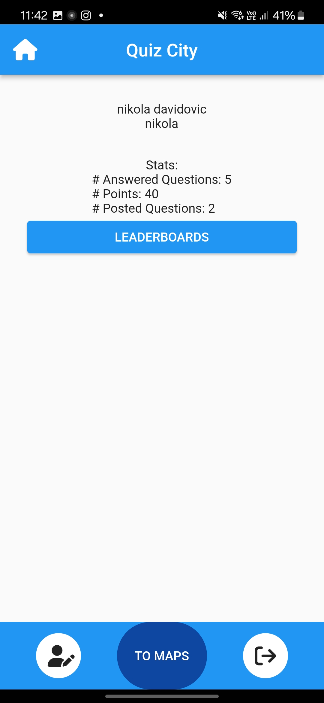
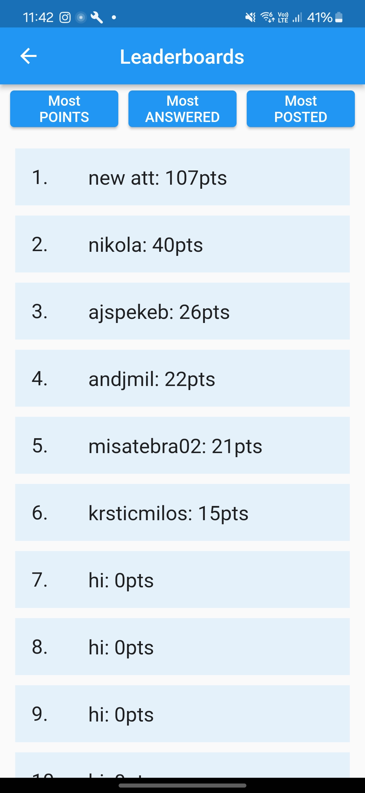
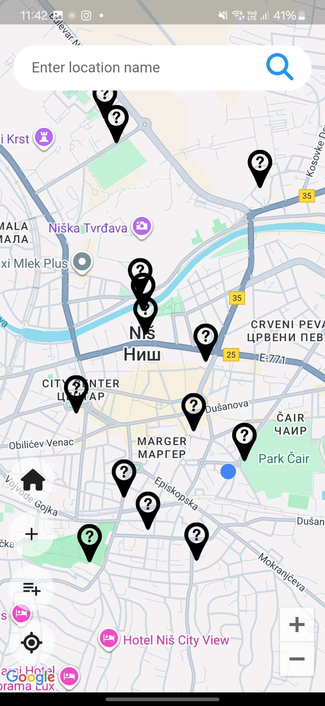
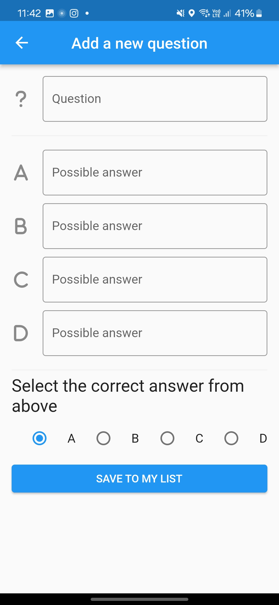

# QuizCity - Historical City Explorer

<div align="center">


**Connect with your city's history through location-based questions and gamification**

[Report Bug](https://github.com/krsticmilos02/RMAS/issues) · [Request Feature](https://github.com/krsticmilos02/RMAS/issues)

</div>

---

## 📖 About The Project

QuizCity is a location-based mobile application that gamifies learning about local history and culture. Users can discover, answer, and create questions tied to specific geographic locations, competing on a leaderboard while exploring their city.

The app transforms urban exploration into an interactive educational experience by placing quiz questions at real-world locations on a map, encouraging users to physically visit historical sites and learn about their surroundings.

### 🎯 Core Concept

- **Explore**: Navigate a real-time Google Map with question markers
- **Learn**: Answer location-based questions about history and local culture
- **Contribute**: Create new questions for other users to discover
- **Compete**: Earn points and climb the leaderboard

---

## ✨ Key Features

### 📍 Location-Based Gameplay
- **Real-time map integration** using Google Maps API
- Questions tied to specific geographic coordinates
- Location-aware question discovery

### 🎮 Gamification System
- **Smart scoring mechanism**:
  - First attempt: 10 points
  - Second attempt: 5 points
  - Third attempt: 2 points
  - Fourth attempt: 1 point
- Leaderboard system tracking user rankings
- Encourages accuracy and knowledge retention

### 📝 User-Generated Content
- **Two question types**:
  - Pre-existing questions (curated content)
  - User-created questions (community-driven)
- Multiple choice format (A, B, C, D)
- Users define correct answers when creating questions
- Dynamic content expansion through community participation

### 🔄 Real-Time Synchronization
- Firebase Realtime Database integration
- Instant updates across all connected devices
- Seamless data persistence

---

## 🛠️ Tech Stack

### Frontend
- **Flutter** - Cross-platform mobile framework
- **Dart** - Programming language
- **Google Maps Flutter** - Map integration and geolocation

### Backend & Services
- **Firebase Authentication** - User management
- **Firebase Realtime Database** - Data storage and synchronization

### APIs & Libraries
- Google Maps API
- Firebase SDK
- Location services

---

## 🚀 Getting Started

### Prerequisites

- Flutter SDK (3.0.0 or higher)
- Dart SDK
- Android Studio / Xcode
- Firebase account and project setup
- Google Maps API key

### Installation

1. **Clone the repository**
```bash
git clone https://github.com/krsticmilos02/RMAS.git
cd RMAS
```

2. **Install dependencies**
```bash
flutter pub get
```

3. **Configure Firebase**
   - Create a Firebase project at [Firebase Console](https://console.firebase.google.com/)
   - Download `google-services.json` (Android) and `GoogleService-Info.plist` (iOS)
   - Place configuration files in appropriate directories:
     - Android: `android/app/`
     - iOS: `ios/Runner/`

4. **Add Google Maps API Key**
   - Obtain API key from [Google Cloud Console](https://console.cloud.google.com/)
   - Add to `android/app/src/main/AndroidManifest.xml`:
```xml
<meta-data
    android:name="com.google.android.geo.API_KEY"
    android:value="YOUR_API_KEY_HERE"/>
```
   - Add to `ios/Runner/AppDelegate.swift` for iOS

5. **Run the application**
```bash
flutter run
```

---

## 📱 Application Flow

### User Journey

1. **Authentication** - Users sign in via Firebase Authentication
2. **Map View** - Main screen displays Google Map with question markers
3. **Question Discovery** - Tap markers to view location-based questions
4. **Answer Attempt** - Select from 4 multiple-choice options (max 4 attempts)
5. **Point Accumulation** - Earn points based on attempt number
6. **Leaderboard** - View ranking among all users
7. **Question Creation** - Add new questions at current or selected locations

### Question Types

**Existing Questions**
- Pre-populated by administrators or curators
- Ensure consistent quality and accuracy
- Cover major historical sites and landmarks

**User-Created Questions**
- Created in real-time by the community
- Allow for diverse topics and perspectives
- Expand content organically

---

## 🏗️ Project Structure

```
RMAS/
│
├── lib/
│   ├── models/           # Data models (Question, User, Location)
│   ├── screens/          # UI screens (Map, Question, Leaderboard)
│   ├── services/         # Firebase services and API calls
│   ├── widgets/          # Reusable UI components
│   └── main.dart         # Application entry point
│
├── android/              # Android-specific configuration
├── ios/                  # iOS-specific configuration
├── assets/               # Images, fonts, static resources
└── pubspec.yaml          # Dependencies and project metadata
```

---

## 🎯 Scoring System

The application implements a progressive scoring mechanism to encourage accuracy:

| Attempt No | Points Awarded | Strategy                          |
|------------|----------------|-----------------------------------|
| 1          | 10 points      | Rewards immediate correct answers |
| 2          | 5 points       | Allows for reconsideration        |
| 3          | 2 points       | Minimal penalty for learning      |
| >=4        | 1 point        | You tried but still able to learn |

There's no penalty for answering the question after the 4th attempt

---

## 🔐 Firebase Architecture

### Authentication
- Email/password authentication
- User profile management
- Session handling

### Database Structure
```
users/
  ├── {userId}/
      ├── username
      ├── points
      └── answeredQuestions[]

questions/
  ├── {questionId}/
      ├── text
      ├── options: [A, B, C, D]
      ├── correctAnswer
      ├── location: {lat, lng}
      ├── createdBy
      └── category

leaderboard/
  ├── {userId}/
      ├── username
      └── totalPoints
```

---

## 🎨 Screenshots

<p align="center">
  
  
  
  
  
</p>

---

## 🚧 Development Notes

This project was developed as part of the "Razvoj Mobilnih Aplikacija i Servisa" (Mobile Application and Services Development) course. The focus was on implementing core functionality and backend integration rather than UI polish.

### Current Implementation Status

✅ **Completed Features**
- Real-time map integration with Google Maps
- Firebase authentication and database
- Question posting and answering system
- Scoring mechanism with attempt-based points
- Leaderboard functionality
- User-generated content creation

🔄 **Potential Enhancements**
- UI/UX improvements and modern design
- Question categories and filtering
- Photo attachments for questions
- Social features (comments, sharing)
- Offline mode support
- Push notifications for nearby questions

---

## 🤝 Contributing

While this is an academic project, contributions and suggestions are welcome:

1. Fork the Project
2. Create your Feature Branch (`git checkout -b feature/Enhancement`)
3. Commit your Changes (`git commit -m 'Add some Enhancement'`)
4. Push to the Branch (`git push origin feature/Enhancement`)
5. Open a Pull Request

---

## 📚 Learning Outcomes

This project demonstrates proficiency in:

- **Cross-platform mobile development** using Flutter
- **Backend integration** with Firebase services
- **Real-time data synchronization** and state management
- **Geolocation services** and map integration
- **User authentication** and security
- **Database design** and NoSQL architecture
- **API integration** (Google Maps)
- **Gamification mechanics** and user engagement strategies

---

## 📞 Contact

Miloš Krstić - [@krsticmilos02](https://github.com/krsticmilos02)

Project Link: [https://github.com/krsticmilos02/RMAS](https://github.com/krsticmilos02/RMAS)

---

<div align="center">

**Built with Flutter & Firebase**

*Transforming city exploration into an interactive learning experience*

</div>
